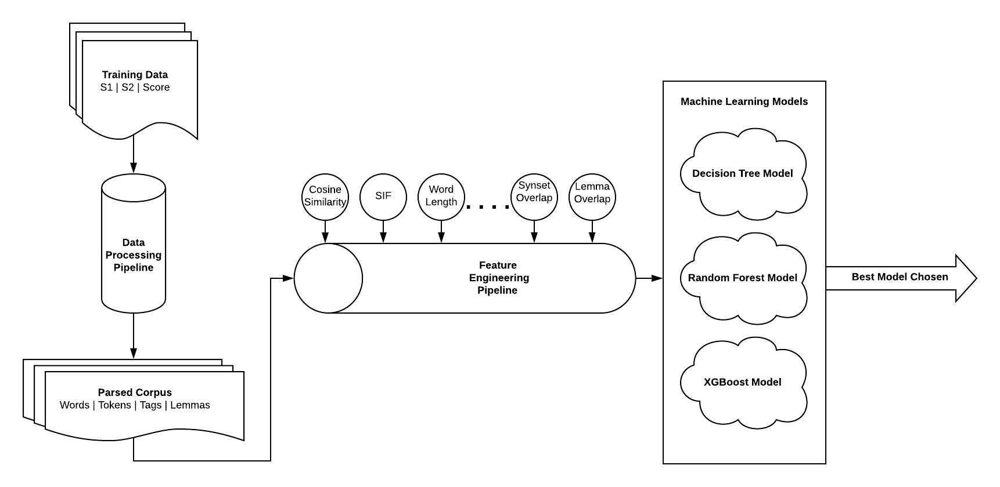

# Sentence Similarity with Random Forest

## UTD CS6320 - Natural Language Processing - Fall 2019

### Shruti Agrawal and Pat Dayton

## To Run

Note that Stanford CoreNLP needs to be running in order to run the syntactic parsing aspects of the demo. After downloading the CoreNLP software into a folder called `corenlp` simply run the following command to make the API accessible:
`java -mx4g -cp "./corenlp/*" edu.stanford.nlp.pipeline.StanfordCoreNLPServer -port 9000 -timeout 15000`

To run the jupyter notebooks, simply run `jupyter notebook` in the root directory.

Corpus sets (dev-set.txt, test-set.txt, etc. ) should be kept in a folder called `data` in the root directory.

Pickle models will be saved to a folder called `model` in the root directory.

Text outputs like predictions will be saved to a folder called `output` in the root directory.

## Description of the Problem Statement

Our task was to design and implement a model for determining the textual similarity between two sentences or chunks of text on a 1 to 5 scale. A higher score means that the two sentences are more similar. A lower score means they are less similar. Some examples from the training data are seen here:

Sentence 1: ''The Hulk'' was a monster at the box office in its debut weekend, taking in a June opening record of $62.6 million.	
Sentence 2:  "The Hulk" took in $62.6 million at the box office, a monster opening and a new June record.
Score: 5

Sentence 1: Congratulations on being named Time magazine's Person of the Year.
Sentence 2: Time magazine named the American soldier its Person of the Year for 2003.
Score: 2

## Possible Use Cases for these Techniques

Textual similarity, at its root, is simply a metric for determining the meaning of a given chunk of text with respect to another corpus. Thus there are myriad uses for the technology.
Search engines like Google use text similarity to ensure their users are receiving links to sites with a high degree of similarity to the search terms provided. Online forums, specifically question and answer based forums, need a way to identify duplicate questions so that they can be grouped and more easily be found by their users. Quora, an online Q&A forum company, created a Kaggle competition to help improve their algorithm.

## Approach

Our proposed solution was to create a variety of features describing each sentence in terms of its word choice and semantic properties. These features were then fed into a variety of decision-tree-based models including SciKit Learn’s Decision Tree and Random Forest Models, and the more powerful ensemble machine learning model called XGBoost (more later). Python was used for the application.

### Architecture

Exploring a few parts of the diagram we see that there are two major pipelines in the system. First the Data Processing Pipeline takes in the Training data (or test data or any other corpus) and outputs a parsed corpus dictionary. From this corpus dictionary we can access:
Raw Sentences
Tokens
Lemmas
Part-of-Speech Tags

Next the Feature Engineering Pipeline calls a variety of methods on each entry in the corpus to create a series of features to be fed to the Machine learning Models. These features, explained further in the following sections, make up the numerical representation of similarity from which the model can derive a score.

Finally the Machine Learning Models calculate three different score arrays. After training we run these models on the test data to see which one performs the best. The model with the best accuracy will then be used to determine our estimate for the test data.

### Machine Learning Models

We used three Machine Learning Models in our architecture. For a baseline model we implemented SciKit Learn’s Decision Tree model which is fast to train and can give basic indication of improvement in our model.

Once we had our base set of features in place we added the SciKit Learn Random Forest model. This is an ensemble learning method that utilizes many decision trees to form a more accurate model.

Finally we implemented XGBoost, or eXtreme Gradient Boosting, which is an ensemble gradient boosting model. Much heavier than the Random Forest model it often yielded better results depending on the input features.

### Features Used

The feature engineering pipeline was our primary area of experimentation. We constantly tried new features and new combinations of features to maximize the output from our machine learning model.

#### Cosine Similarity of Embedding

Cosine Similarity is a measure of the similarity of two pieces of text regardless of the size of either. Abstractly, cosine similarity graphs the embeddings of the text in three-dimensional space and takes the cosine of these vectors as a measure of their similarity. We actually created two features with this property. The first, a simple one based on local TF-IDF embeddings calculated by SKLearn. The second, from a more robust set of embeddings calculated by the natural language processing package Spacy.

#### Smooth Inverse Frequency (SIF) Similarity

Another baseline similarity similar to the cosine similarity, SIF takes a weighted average of the word vectors when compared to the corpus.

#### Word, Lemma, and Synset Overlaps

We created a few features based on overlaps in the two sentences. First we created simple word overlaps, i.e. how many words do the sentences share. We then took a normalized form of this, dividing by the number of words in the two sentences.

Next we used the same idea, but rather than using the full token, we lemmatized the word so there was a bit more ambiguity, but higher possibility of overlap. Again we also took a normalized form.

Finally we took the synset overlap by creating an array of the lemmas found in the synsets of each of the words in the sentences. Again we also took a normalized form.

#### Sentence Length

A surprisingly helpful feature was simple sentence length for both sentences.

#### Path Similarity

Path similarity scores how similar two word senses are by computing shortest number of edges from one word sense to another word sense, assuming a hierarchical structure like WordNet in the is-a (hypernym/hypnoym) taxonomy. In general, word senses which have a longer path distance are less similar than those with a very short path distance. Path similarity is not commutative by design, hence we have defined another function for computing a symmetric similarity which takes the average of two cases.

#### Named Entity Overlap

A named entity is a “real-world object” that’s assigned a name. The named entity recognition module with Spacy (used here) classifies these instances as one of the following entities: Person, National, religious or political groups, Buildings, Organizations, Geographic locations, Products, Events, Artworks, Laws, Language, Date, Time, Percentages, Money, Quantities, Ordinals and Cardinals.

### A Few Features We Did NOT Use

We tried to incorporate many more semantic similarity features, both with and without information content, such as Wu-Palmer Similarity, Leacock-Chodorow Similarity, Lin Similarity, Jiang-Conrath Similarity, Resnik Similarity, however the accuracy gradually decreased as we added any one of the above as a feature.

We also looked at some syntactic features, such as a head verb and head noun overlap, but this, for some reason, decreased the similarity by approximately 10%. There were other syntactic features that we did not particularly stress on, but could have marginally improved the accuracy, such as those based on dependency parsing.

## Results & Error Analysis

We used the train.txt as our training data and used the dev.txt data as our testing set during the development process. With our three models we got the following results:

Decision Tree
Accuracy: 0.413
Avg. Err.: 0.833
F-Score: 0.423

Random Forest
Accuracy: 0.459
Avg. Err.: 0.749
F-Score: 0.464

XGBoost
Accuracy: 0.435
Avg. Err.: 0.769
F-Score: 0.445

As you can see, the Random Forest model gave the strongest results, classifying the dev-data correctly about 46% of the time. Note that random guessing should give you about 20%. Furthermore it can be seen that the average error was small, as our model, on average, predicted within 0.749 of the correct score. Plugging our predictions into the provided evaluation script, our final Random Forest model received a Pearson Correlation Score of .412.

### Issues Encountered and Future Improvement

Most of our success in this project came from bag-of-words style features. Though we only chose to implement about 12 features, we tried somewhere around 25 total features. Many of the ones that we ended up not including involved the semantic and syntactic features of the sentences. We feel that there are at least a few more percentage points of accuracy we could squeeze out of the dataset if we were to find the right semantic and syntactic features.

We also faced some simple, yet significant issues with working with some of the tools. Getting Spacy to work correctly on a Windows machine proved difficult. Jupyter notebooks often did not play well with GitHub. And portinusing Stanford CoreNLP as an API was a bit tough and writing loops efficiently such that the training time took a manageable amount of time was difficult as well.

Given more time we would have liked to experiment with some of the more robust embedding systems like B.E.R.T., and possibly train a deep learning system on a GPU. Also spending more time fine-tuning our Machine Learning models to the data we fed in may have boosted our scores as well.

### Programming Tools

Python 3
Jupyter Notebooks
Sci Kit Learn
XGBoost
Numpy
Pandas
NLTK
Spacy
TensorFlow
Stanford Open NLP
Pickle

### Citations

https://www.kaggle.com/c/quora-question-pairs
https://machinelearningmastery.com/gentle-introduction-xgboost-applied-machine-learning/
https://www.machinelearningplus.com/nlp/cosine-similarity/
https://openreview.net/pdf?id=SyK00v5xx
https://medium.com/data-from-the-trenches/how-deep-does-your-sentence-embedding-model-need-to-be-cdffa191cb53
